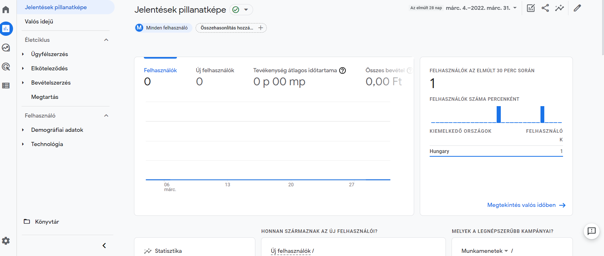

# React & Google Analytics 4

## 1. Create a base react project

```
yarn create react-app my-app
```


## 2. Integrate Google Analytics 4

``` 
yarn add react-ga4
``` 

```
yarn build
```

## 3. Create new Analytics Property

- Build project in Netlify.com
- Create a new property in Google Analytics
- Don’t select advanced and Universal tracking
- Now after the setup, pick the “web” data stream.
- Enter your website URL and continue (Netlify link)
- Select the Global site tag (gtag.js) option and copy the code.
- Paste the code to public/index.html head tag


## 4. Run React application 

```
yarn start
```


## 5. Check the real time events on Goodle Analytics!!

- Realtime overview




## Source: 
https://tamalweb.com/google-analytics-with-reactjs


